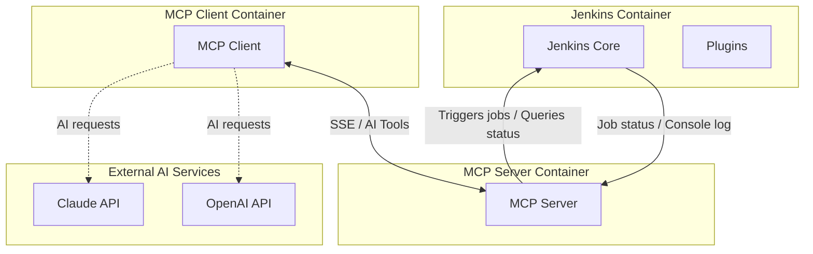

# mcp-jenkins-adapter

**⚠️ This is a Proof of Concept (PoC) project - NOT production ready**

**🔒 SECURITY WARNING:** This project contains known security limitations and should only be used in isolated development environments. Do not expose to the internet or use with production Jenkins instances.

This project demonstrates a fully containerized MCP client-server application that interacts with Jenkins via an API token, and leverages AI LLMs (OpenAI/Claude) for AI-powered functionalities in Jenkins.

## TODO: Production Readiness

### Security & Authentication
- [ ] Implement full secure logging
- [ ] Implement user authentication and session management
- [ ] Add role-based access control (RBAC) for tool execution
- [ ] Implement API key rotation mechanism
- [ ] Secure credential management (HashiCorp Vault integration)
- [ ] Add audit logging for all tool executions
- [ ] Implement secure logging with sensitive data redaction
- [ ] Add input sanitization for all user inputs
- [ ] Implement request signing/verification
- [ ] Add TLS/SSL for all communications
- [ ] Container security hardening (non-root users, read-only filesystems)

### Reliability & Performance
- [ ] Add comprehensive error handling and retry mechanisms with exponential backoff
- [ ] Implement circuit breakers for external service calls
- [ ] Add rate limiting and request throttling (per-user and global)
- [ ] Implement request queuing and prioritization
- [ ] Add connection pooling for Jenkins API calls
- [ ] Performance optimization and resource limits
- [ ] Implement graceful shutdown with connection draining
- [ ] Add timeout configurations for all operations

### Data Persistence & Context Management
- [ ] Replace in-memory conversation history with database storage (PostgreSQL/MongoDB)
- [ ] Implement RAG (Retrieval-Augmented Generation) for intelligent context retrieval
- [ ] Add vector database integration (Pinecone, Weaviate, or pgvector) for semantic search
- [ ] Store Jenkins logs and build history for long-term analysis
- [ ] Implement conversation session management with persistence
- [ ] Add conversation history archival and cleanup policies
- [ ] Create indexes for efficient conversation and log retrieval
- [ ] Implement conversation context windowing with relevance scoring

### Observability
- [ ] Implement structured logging (JSON format)
- [ ] Add distributed tracing (OpenTelemetry)
- [ ] Set up metrics collection (Prometheus)
- [ ] Add health check endpoints
- [ ] Implement readiness and liveness probes
- [ ] Add performance monitoring and alerting
- [ ] Create dashboards for monitoring

### Testing & Quality
- [ ] Add comprehensive unit test coverage (>80%)
- [ ] Implement integration tests
- [ ] Add end-to-end tests
- [ ] Add security testing (SAST/DAST)
- [ ] Implement dependency vulnerability scanning

### Configuration & Deployment
- [ ] Configuration validation on startup
- [ ] Support for multiple deployment environments
- [ ] Implement feature flags
- [ ] Create Kubernetes deployment manifests
- [ ] Set up CI/CD pipeline

### Documentation
- [ ] Add API documentation (OpenAPI/Swagger)
- [ ] Create operational runbooks
- [ ] Add troubleshooting guides
- [ ] Document security best practices

---

## Project Overview

Main feature of the project is using AI LLMs through the MCP Client for processing or summarizing Jenkins data.

- **Jenkins** – Main CI/CD server, configured with functional MCP user for automated job operations.
- **MCP Server** – Provides AI-powered tools, connects to Jenkins and exposes a SSE endpoint for clients.
- **MCP Client** – Handles interaction with AI LLMs (OpenAI/Claude) and connects to MCP server via SSE, bridging those services together.
- **AI LLMs** – Using provided AI-powered tools to trigger jobs and process Jenkins job data.

The MCP server uses a **Jenkins API token** generated at Jenkins startup.

---

## Architecture Overview



---

## Folder Structure

```
jenkins-mcp-adapter/
├── .gitignore                    # Git ignore rules
├── .env.example                  # Example environment variables
├── CHANGELOG.md                  # Version history and changes
├── docker-compose.yaml           # Container orchestration
├── Dockerfile.jenkins            # Jenkins container image
├── LICENSE                       # GNU GPL v3.0
├── Makefile                      # Build and deployment commands
├── README.md                     # This file
├── init.groovy.d/                # Jenkins initialization scripts
│   ├── create-users.groovy       # Creates admin and MCP users
│   └── seed-job.groovy           # Seeds demo Jenkins job
├── jenkins-secrets/              # Generated at runtime (git-ignored)
│   └── mcp-user.token            # Jenkins API token for MCP user
├── mcp-client/                   # MCP Client application
│   ├── Dockerfile
│   ├── go.mod
│   ├── go.sum
│   ├── main.go                   # Client entry point
│   └── llm/                      # LLM provider abstraction
│       ├── provider.go           # Provider interface
│       ├── openai.go             # OpenAI implementation
│       └── claude.go             # Claude implementation
└── mcp-server/                   # MCP Server application
    ├── config
    │   └── config.go
    ├── Dockerfile
    ├── go.mod
    ├── go.sum
    └── main.go                   # Server entry point with Jenkins tools
```

---

## Prerequisites

- Podman/Docker
- Podman/Docker Compose
- `.env` file with required variables (see below)
- OpenAI API key or Claude API key (depending on your LLM_PROVIDER choice)

---

## Environment Variables (`.env`)

Create a `.env` file in the project root:

```env
# Jenkins Configuration
JENKINS_ADMIN_USER=admin
JENKINS_ADMIN_PASS=your_secure_password_here
JENKINS_MCP_USER=mcp-user
JENKINS_MCP_PASS=your_secure_mcp_password_here

# AI LLM Configuration
LLM_PROVIDER=openai  # Options: "openai" or "claude"

# OpenAI Configuration (if using OpenAI)
OPENAI_API_KEY=sk-...your_key_here

# Claude Configuration (if using Claude)
CLAUDE_API_KEY=sk-ant-...your_key_here

# Optional: MCP Server URL (default: http://localhost:8081/sse)
# MCP_SERVER_URL=http://mcp-server:8081/sse
```

**⚠️ Security Note:** Never commit the `.env` file to version control. Add it to `.gitignore`.

---

## Running the Stack

```bash
# Step 1: Initialize Jenkins to create MCP user and API token
$ podman-compose up --build -d jenkins

# Step 2: Wait for Jenkins to fully initialize (30-60 seconds)
$ podman-compose logs -f jenkins
# Wait until you see: "Jenkins is fully up and running"

# Step 3: Create directory and file for the token
$ mkdir -p ./jenkins-secrets
$ touch ./jenkins-secrets/mcp-user.token

# Step 4: Extract and store the API token
$ podman-compose exec jenkins cat /var/jenkins_home/secrets/mcp-user.token > ./jenkins-secrets/mcp-user.token

# Step 5: Verify the token was saved
$ cat ./jenkins-secrets/mcp-user.token

# Step 6: Start remaining services
$ podman-compose up --build -d

# Step 7: Verify all services are running
$ podman-compose ps
```

---

## Accessing Services

### Jenkins UI
- **URL:** http://localhost:8082/jenkins
- **Username:** Value from `JENKINS_ADMIN_USER`
- **Password:** Value from `JENKINS_ADMIN_PASS`

### MCP Server
- **SSE Endpoint:** http://localhost:8081/sse
- **Note:** This is an internal endpoint used by the MCP client

### MCP Client
```bash
# Enter the container
$ podman-compose exec mcp-client sh

# Start an interactive session
$ mcp-client

# Expected output:
MCP initialized. Server: {Name:jenkins-mcp Version:1.0.0}
Using LLM provider: openai
Jenkins LLM Bridge started. Type your prompts:

# Example commands:
> start demo-job
> check status of demo-job build 1
> show me logs for demo-job build 1
> troubleshoot demo-job build 1
```

---

## Available MCP Tools

The MCP server exposes the following tools for Jenkins interaction:

### 1. `trigger_job`
Trigger a Jenkins job by name, optionally with parameters.

**Example:**
```
> run demo-job
> start build for my-pipeline
```

### 2. `get_build_status`
Get the status of a specific build.

**Example:**
```
> status of demo-job build 5
> check demo-job
```

### 3. `get_console_log`
Retrieve console log for a specific build number.

**Example:**
```
> logs for demo-job build 3
> show console output for my-pipeline build 10
```

### 4. `analyze_logs`
AI-powered log analysis that:
1. Fetches logs from Jenkins via MCP Server
2. Sends logs to configured AI LLM (OpenAI/Claude)
3. Returns analysis with error explanations and fixes

**Example:**
```
> troubleshoot demo-job build 2
> why did my-pipeline build 5 fail?
> debug the last build
```

**Note:** `analyze_logs` is a client-side helper function that combines `get_console_log` with AI analysis. It's not exposed as a standalone MCP tool.

---

## LLM Provider Selection

The application supports multiple AI providers. Configure via the `LLM_PROVIDER` environment variable:

### OpenAI (GPT-4)
```env
LLM_PROVIDER=openai
OPENAI_API_KEY=sk-...
```

### Claude (Sonnet 3.5)
```env
LLM_PROVIDER=claude
CLAUDE_API_KEY=sk-ant-...
```

The provider is selected at runtime based on the environment variable.

---

## Security Considerations

**⚠️ This PoC has known security limitations:**

1. **No Authentication:** The MCP server has no authentication mechanism
2. **Plaintext Communication:** No TLS/SSL encryption
3. **Exposed Credentials:** API tokens stored in files
4. **No Rate Limiting:** Susceptible to abuse
5. **Limited Input Validation:** Some injection vulnerabilities exist
6. **No Audit Logging:** No tracking of who did what

**Implemented Security Measures:**
- Input validation for job names (alphanumeric, dash, underscore, dot only)
- Tool name whitelisting
- Parameter type validation
- Context-based cancellation for graceful shutdown
- Memory limits via history size constraints

**For Production Use, You Must:**
- Implement proper authentication (OAuth2, JWT)
- Add TLS/SSL for all communications
- Use a proper secrets management system (Vault, AWS Secrets Manager)
- Add comprehensive audit logging
- Implement rate limiting and DDoS protection
- Add network segmentation and firewall rules

---

## Troubleshooting

### Jenkins not starting
```bash
# Check logs
$ podman-compose logs jenkins

# Common issue: Port already in use
$ lsof -i :8082
$ kill -9 <PID>
```

### MCP Client can't connect to server
```bash
# Verify MCP server is running
$ podman-compose ps mcp-server

# Check network connectivity
$ podman-compose exec mcp-client ping mcp-server

# Verify token exists
$ cat ./jenkins-secrets/mcp-user.token
```

### LLM API errors
```bash
# Verify API key is set
$ podman-compose exec mcp-client env | grep API_KEY

# Check provider is correct
$ podman-compose exec mcp-client env | grep LLM_PROVIDER
```

### Build fails with "Invalid job_name"
- Job names can only contain: letters, numbers, dash (-), underscore (_), and dot (.)
- Maximum length: 100 characters

---

## Development

### Running Tests
```bash
# MCP Server tests
$ cd mcp-server && go test ./...

# MCP Client tests
$ cd mcp-client && go test ./...
```

### Adding a New LLM Provider
1. Create new provider file in `mcp-client/llm/`
2. Implement the `Provider` interface
3. Add provider to `NewProvider()` factory function
4. Update documentation

---

## Notes / Best Practices

- Always ensure `jenkins-secrets/mcp-user.token` exists before starting the client-server stack
- `.env` values are loaded dynamically for security (but still not production-safe)
- Podman Compose handles service dependencies, but Jenkins must initialize before MCP server
- **Never** store sensitive credentials directly in `docker-compose.yml`
- Add `.env` to `.gitignore` to prevent credential leaks
- The MCP client uses conversation history limiting (max 50 messages) to prevent memory exhaustion
- All tool calls are validated against a whitelist to prevent unauthorized operations

---

## Stopping the Stack

```bash
# Using Makefile
$ make down             # Stop all services
$ make clean            # Stop and remove volumes (deletes all data)

# Using podman-compose directly
$ podman-compose down
$ podman-compose down -v  # Remove volumes too

# Stop specific service
$ podman-compose stop mcp-client
```

This will stop all containers. The `jenkins_home` volume persists unless explicitly removed with `make clean` or `podman-compose down -v`.

---

## Known Limitations

1. **Single User:** No multi-user support
2. **No Persistence:** LLM conversation history is not persisted (stored in-memory only)
3. **Limited Context:** Conversation history limited to 50 messages; older context is lost
4. **No RAG:** Cannot retrieve relevant historical information from past conversations or builds
5. **Limited Error Recovery:** Network failures may require manual restart
6. **No Job Queuing:** Concurrent job triggers may conflict
7. **Memory Constraints:** Large log files may cause issues
8. **No Horizontal Scaling:** Single instance only
9. **Session Loss:** Restarting the client loses all conversation context
10. **No Analytics:** Cannot track patterns or trends across multiple builds/conversations

---

## Contributing

This is a PoC project. Contributions are welcome but please note:
1. All PRs should include tests
2. Follow existing code style
3. Update documentation
4. Security improvements are prioritized

---

## License

This project is licensed under the GNU General Public License v3.0 - see the [LICENSE](LICENSE) file for details.

---

## Acknowledgments

- Built with [MCP Go SDK](https://github.com/mark3labs/mcp-go)
- Uses [Jenkins REST API](https://www.jenkins.io/doc/book/using/remote-access-api/)
- AI providers: OpenAI, Anthropic Claude
